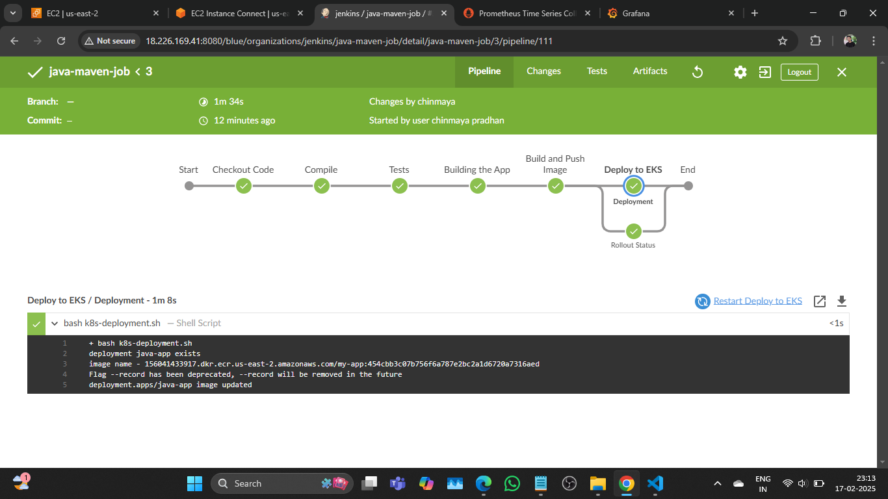
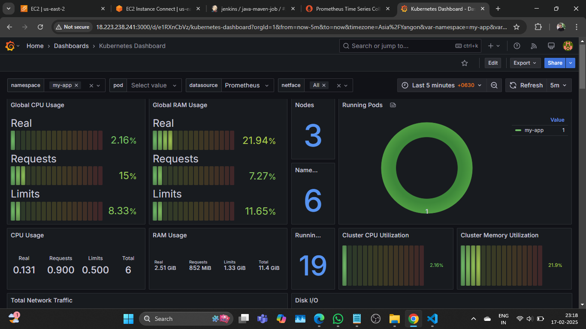

# Jenkins CI/CD Pipeline for EKS Deployment

This repository contains a Jenkins pipeline that automates the deployment of a Java application to an Amazon EKS cluster. The infrastructure is provisioned using Terraform, including an ALB Ingress Controller for managing external access. Monitoring is handled via Prometheus and Grafana.

## Features
- **Infrastructure as Code (IaC):** EKS cluster configured using Terraform.
- **ALB Ingress Controller:** Manages external traffic.
- **Jenkins Pipeline:** Automates build, testing, security scanning, containerization, and deployment.
- **ECR for Image Storage:** Container images are stored in AWS ECR.
- **Prometheus & Grafana Monitoring:** Provides observability into the Kubernetes cluster.

## Prerequisites
- AWS CLI configured with proper permissions
- Terraform installed
- Jenkins with necessary plugins (Pipeline, SonarQube, Kubernetes CLI, AWS Credentials)
- Docker installed on Jenkins Server
- Prometheus and Grafana deployed in the EKS cluster

## Terraform Configuration
The Terraform scripts set up:
- VPC, Subnets, and Security Groups
- EKS Cluster
- IAM Roles and Policies
- ALB Ingress Controller
- Prometheus and Grafana for monitoring

## Jenkins Pipeline
The Jenkinsfile automates the following steps:
1. **Checkout Code**: Retrieves the latest code from the repository.
2. **Compile Application**: Uses Maven to compile the Java application.
3. **Run Tests**: Executes unit tests.
4. **SonarQube Analysis**: Performs static code analysis.
5. **Build Docker Image**: Packages the application into a Docker image.
6. **Push to ECR**: Uploads the built image to AWS Elastic Container Registry.
7. **Deploy to EKS**: Updates the Kubernetes deployment using `kubectl`.
8. **Verify Deployment**: Ensures the application is successfully rolled out.

## Deployment
### Apply Terraform Configuration
```sh
cd terraform
terraform init
terraform apply -auto-approve
```

### Run Jenkins Pipeline
Trigger the Jenkins pipeline to deploy the application.

### Validate Deployment
```sh
kubectl get pods -n my-app
kubectl get svc -n my-app
```

### Access Application
Retrieve the ALB DNS name and access the application via a browser.

### Monitoring
- Access Grafana dashboard: `http://<grafana_url>`
- Check Prometheus metrics: `http://<prometheus_url>`

## Monitoring Dashboard

### CI/CD Pipeline


### Prometheus & Grafana Dashboard


## Cleanup
To destroy the infrastructure:
```sh
terraform destroy -auto-approve
```

## Conclusion
This setup provides a complete CI/CD pipeline for deploying a Java application to an EKS cluster with monitoring and ingress management using ALB. It ensures high availability, security, and observability.
